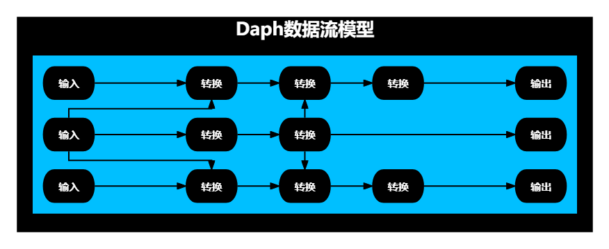
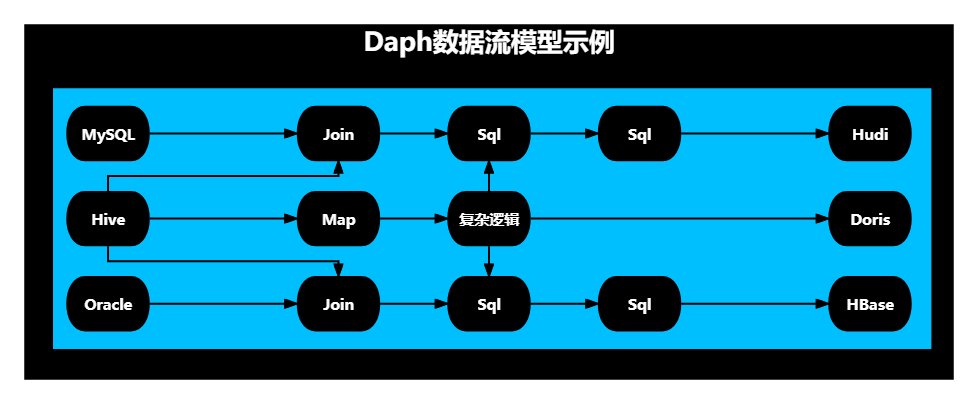
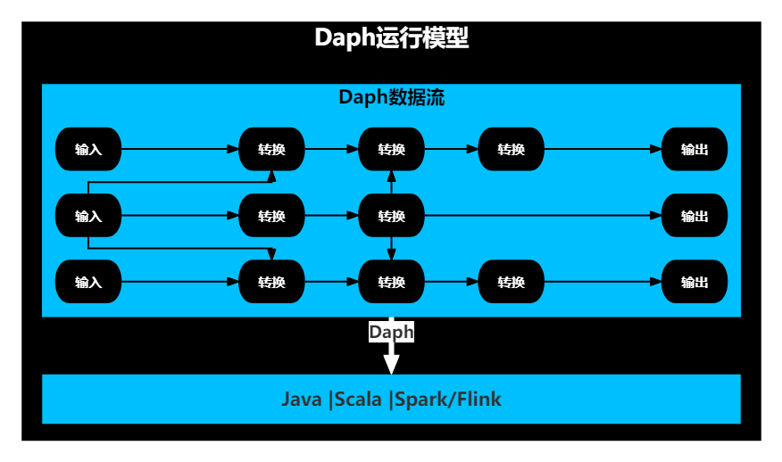

# Dasea Daph

<!-- TOC -->
  * [概述](#概述)
  * [功能](#功能)
  * [价值](#价值)
  * [特点](#特点)
  * [对比业界类似软件](#对比业界类似软件)
  * [架构模型](#架构模型)
    * [数据流模型](#数据流模型)
    * [运行模型](#运行模型)
    * [部署模型](#部署模型)
  * [版本说明书](#版本说明书)
  * [使用手册](#使用手册)
  * [二次开发手册](#二次开发手册)
  * [联系我](#联系我)
<!-- TOC -->

## 概述

Daph的中文名称是大副，大副是职位仅低于船长的船舶驾驶员，甲板部（驾驶部）负责人，船长的主要助手。 
Daph的英文名称，取自【有向无环图Directed Acyclic Graph】的第一个字母与最后三个字母。

Daph是一个通用的数据集成与数据处理平台级工具，可用于构建可视化配置化的数据集成与数据处理平台。

Daph，大道至简。 
Daph的核心概念是节点，节点具有输入线与输出线，每条线中承载数据，节点承载任意数据处理逻辑。 
Daph的核心构件是一个自创的通用DAG数据流引擎，可以流转任意Java/Scala数据结构，可以引入任何基于Java平台或具有Java客户端的数据计算组件作为数据流底层数据计算引擎。 
Daph的核心功能是联接多个节点构成DAG图，并流转数据。

## 功能
* **全量增量整库整表数据集成**：以极简配置方式，完成全量增量整库整表数据集成
  * 已支持50多种数据源类型的全量整表同步
  * 已支持Flink-cdc所支持的所有数据源类型的cdc整表同步
  * 已支持mysql/postgresql/oracle/sqlserver/doris/starrocks到mysql/postgresql/oracle/sqlserver/doris/starrocks/hive/iceberg/kafka的全量增量整库同步
* **流批一体复杂数据处理**：以极简配置方式，完成流批一体任意复杂多表sql处理逻辑

## 价值

* **统一数据开发视图**：Daph既具有丰富的数据集成能力，又具有强大的数据处理能力
* **降低数据开发门槛**：通过配置文件，完成数据开发
* **缩短数据开发周期**：开箱即用的海量数据集成与数据处理能力，极简的安装部署方式，极简的二次开发过程

## 特点

* **通用**：可连接任意JVM类型的节点，构成DAG图，并流转任意Java/Scala数据结构。因此，不仅目前能够用于构建DAG数据流，而且具有潜在的任意粒度的DAG任务调度的潜力，可基于一个daph-core，统一任务开发与任务调度，实现一体化的可视化任务开发与任务调度平台。
* **简单**：概念简单，配置简单
    * 基于开源计算引擎，不引入新的复杂概念
    * 节点配置简单，比如daph-spark节点配置项，与Spark配置项几乎完全一致，不增加学习开销。
* **强大**：架构强大，功能强大
    * 架构层面具有多层环绕运行体系，可定制任意Job级/DAG级/节点级/方法级功能，比如节点数据预览功能、节点监控功能、前置后置SQL功能。目前所有节点均已支持前置后置建表功能，daph-spark所有节点已支持前置后置SQL功能
    * daph-spark仅有5个连接器、6个转换器，却已支持44种数据源的流批读写，且能随时扩充更多数据源；已支持对单表的map、filter、sql处理，对多表的join及任意复杂sql处理；且支持spark能支持的任何catalog
    * daph-flink仅有2个连接器、1个转换器，却已支持任何flink-sql支持的数据源的流批读写；已支持对单表与多表的任意复杂sql处理；且支持flink能支持的任何catalog。
* **聚焦**：聚焦于可视化配置化的数据集成与数据处理，聚焦于简化开源计算引擎的使用，不增加学习开销。
* **流转任意数据结构**：可流转任意JVM数据结构，比如Java/Scala List、Spark DataFrame、Flink DataStream。
* **支持多种计算引擎**：可引入任何基于Java平台或具有Java客户端的数据计算组件作为数据流底层数据计算引擎，比如Java/Scala/Spark/Flink，等等。
* **快速扩展节点**：可方便地扩展与部署具有任意逻辑的节点，比如扩展新的连接器节点，以支持读写新的数据库类型；比如扩展新的转换器节点，以便引入特定数据处理逻辑处理数据。只需要完成以下三点，即可完成： 
  1）实现一个配置接口与一个功能接口 
  2）将扩展的节点对应的jar放在服务器目录 
  3）json文件中配置扩展节点信息。 
  详见[Daph二次开发手册](docs/zh/二次开发手册/Daph二次开发手册.md)

## 对比业界类似软件

Daph：

1. 既能用于数据集成，又能用于复杂的数据处理
2. 极致通用的DAG模型，能够流转任意JVM对象，引入任意符合Spark/Flink编程模型的计算引擎
3. 不重复造轮子，专注于简化开源计算引擎的使用，配置项几乎与开源计算引擎一一对应
4. 完美运用开源计算引擎的各项能力，包括且不限于流批处理能力、catalog能力、sql能力
5. 能够及时从开源计算引擎的生态系统中获益
    - 比如Spark，一旦新出现一种数据库连接器，在Daph中只需要在pom.xml中添加依赖，就能立刻使用

| 对比维度     | Daph                     | SeaTunnel                             | StreamSets | StreamX     | Kettle | Chunjun |
|----------|--------------------------|---------------------------------------|------------|-------------|--------|---------|
| 通用性      | 高                        | 低                                     | 低          | 低           | 低      | 低       |
| 易用性      | 高                        | 中                                     | 高          | 高           | 高      | 中       |
| 开源       | 是                        | 是                                     | 否          | 是           | 是      | 是       |
| 数据结构流转能力 | 所有JVM对象                  | Dataset[Row]/DataStream[Row]/Zeta数据结构 | 无          | 无           | 无      | 无       |
| 计算引擎接入能力 | 任意符合Spark/Flink编程模型的计算引擎 | Spark/Flink/Zeta                      | Spark      | Spark/Flink | Java   | Flink   |
| 流水线模型    | DAG                      | 线                                     | DAG        | 点           | DAG    | 线       |
| 功能扩展性    | 高                        | 中                                     | 低          | 中           | 低      | 中       |
| 学习成本     | 低                        | 高                                     | 高          | 中           | 中      | 中       |
| 开发成本     | 低                        | 高                                     | 高          | 中           | 高      | 中       |
| 运维成本     | 低                        | 高                                     | 低          | 中           | 低      | 中       |

## 架构模型

### 数据流模型

Daph的数据流模型是DAG数据流模型，如下图所示：

例如一个数据集成与数据处理综合场景，如下图所示：

- 输入是一张MySQL表、一张Hive表，一张Oracle表
- 处理逻辑包含map、join、sql、自定义复杂逻辑
- 输出是一个Hudi表、一个Doris表、一个HBase表

### 运行模型

Daph通过节点包裹代码片段，将节点连成一个DAG图，并最终将DAG图形成一个完整的应用程序。 

- 一个DAG图就是一个完整运行逻辑，比如当使用Spark作为底层计算引擎，一个DAG图就是一个完整的Spark应用程序。 
- 一个DAG图中可以同时包含Java节点、Scala节点、Spark节点，也可以同时包含Java节点、Scala节点、Flink节点，但不能同时包含Spark与Flink节点。
- 底层计算引擎决定了应用程序的类型。 
  JVM引擎对应的就是原生Java/Scala应用程序； 
  Spark引擎对应的就是Spark应用程序； 
  Flink引擎对应的就是Flink应用程序。 

Daph运行模型如下图所示：

### 部署模型

Daph目前的部署模型非常简单，

- daph-jvm，就是部署原生java程序
- daph-spark，就是部署spark应用程序
- daph-flink，就是部署flink应用程序

## 版本说明书

版本说明书的内容包括：

- 每个版本的功能清单
- 每个版本的节点矩阵

详见[版本说明书](docs/zh/版本说明书)

## 使用手册

Daph的使用非常简单。 
详见[Daph使用手册](docs/zh/使用手册/Daph使用手册.md)

## 二次开发手册

Daph的二次开发非常简单。 
详见[Daph二次开发手册](docs/zh/二次开发手册/Daph二次开发手册.md)

## 联系我

