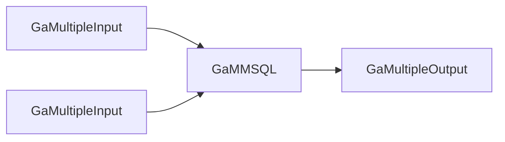

<!-- TOC -->

* [简介](#简介)
* [输入输出数据结构](#输入输出数据结构)
* [配置项](#配置项)
* [使用案例](#使用案例)
    * [作业描述](#作业描述)
    * [DAG图](#dag图)
    * [job.json](#jobjson)

<!-- TOC -->

## 简介

- **节点标识**：Flink117.sql.general.transformer.GaMMSQL
- **节点类型**：转换节点
- **节点功能**：基于截止上游节点时的TableEnv，执行多条flink sql，更新TableEnv，以供下游节点使用最新的TableEnv
- **流批类型**：流批

## 输入输出数据结构

| 输入数据结构   | 输出数据结构   |
|----------|----------|
| 多个String | 多个String |

## 配置项

| 配置名称         | 配置类型               | 是否必填项 | 默认值 | 描述                                                    |
|--------------|--------------------|-------|-----|-------------------------------------------------------|
| queryConfigs | Array[QueryConfig] | 是     | -   | 若数组内只有一个元素，则QueryConfig不必指定line，results会被流转到其所有直接下游节点 |

```scala
// line是输出线，results是该输出线上承载的结果表名，及获取结果表名需填写的sql语句
case class QueryConfig(line: String, results: Array[ResultTableToSql])

// 结果表名，获取结果表名的flink sql查询语句
case class ResultTableToSql(resultTable: String, sql: String)
```

## 使用案例

### 作业描述

- 输入：一个位于mysql_catalog1的daph库下的in_t1表，一个位于mysql_catalog2的daph库下的in_t1表
- 处理：对以上两个表进行join操作，输出tmp_t表
- 输出：将位于default_catalog的default_database库下的tmp_t表，输出到mysql_catalog3的daph库下的out_t7
    - 若out_t7不存在，会自动建表

### DAG图



### job.json

```json
{
  "nodes": [
    {
      "flag": "Flink117.sql.general.connector.GaMultipleInput",
      "config": {
        "catalogName": "mysql_catalog1",
        "databaseName": "daph"
      },
      "outLines": [
        "in-line1"
      ]
    },
    {
      "flag": "Flink117.sql.general.connector.GaMultipleInput",
      "config": {
        "catalogName": "mysql_catalog2",
        "databaseName": "daph"
      },
      "outLines": [
        "in-line2"
      ]
    },
    {
      "flag": "Flink117.sql.general.transformer.GaMMSQL",
      "config": {
        "queryConfigs": [
          {
            "results": [
              {
                "resultTable": "tmp_t",
                "sql": "select * from mysql_catalog1.daph.in_t1 a join mysql_catalog2.daph.in_t1 b on a.id = b.id"
              }
            ]
          }
        ]
      },
      "inLines": [
        "in-line1",
        "in-line2"
      ],
      "outLines": [
        "sql-line"
      ]
    },
    {
      "flag": "Flink117.sql.general.connector.GaMultipleOutput",
      "config": {
        "catalogName": "mysql_catalog3",
        "databaseName": "daph",
        "insertConfigs": [
          {
            "sql": "insert into out_t7 select * from default_catalog.default_database.tmp_t"
          }
        ]
      },
      "inLines": [
        "sql-line"
      ]
    }
  ]
}
```
