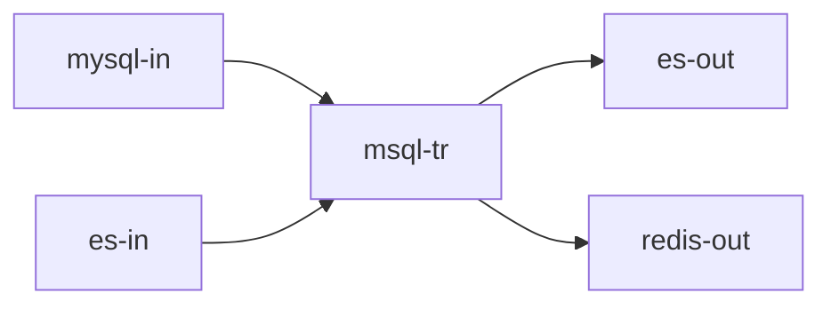

## 简介

- **节点标识**：Spark3.dataframe.general.transformer.MMSql
- **节点类型**：转换节点
- **节点功能**：接收多个dataframe，执行多条sql后得到多个dataframe，并流转到多个下游节点
- **流批类型**：流批

## 输入输出数据结构

| 输入数据结构      | 输出数据结构      |
|-------------|-------------|
| 多个DataFrame | 多个DataFrame |

## 配置项

| 配置名称                | 配置类型               | 是否必填项 | 默认值 | 描述                    |
|---------------------|--------------------|-------|-----|-----------------------|
| inLineIdToTableName | Map[String,String] | 是     | -   | 输入线与表名的映射关系           |
| dataIdToSql         | Map[String,String] | 是     | -   | DataFrame id与sql的映射关系 |
| dataIdToOutLineId   | Map[String,String] | 是     | -   | DataFrame id与输出线的映射关系 |

## 使用案例

### DAG图



### job.json

```json
{
  "nodes": [
    {
      "flag": "Spark3.dataframe.batch.connector.CommonInput",
      "config": {
        "format": "jdbc",
        "cfg": {
          "url": "jdbc:mysql://127.0.0.1:3306/daph",
          "dbtable": "t",
          "user": "root",
          "password": "root",
          "driver": "com.mysql.cj.jdbc.Driver"
        }
      },
      "outLines": [
        "in-line1"
      ]
    },
    {
      "flag": "Spark3.dataframe.batch.connector.CommonInput",
      "config": {
        "format": "es",
        "cfg": {
          "es.nodes": "127.0.0.1:9200,127.0.0.2:9200"
        }
      },
      "outLines": [
        "in-line2"
      ]
    },
    {
      "flag": "Spark3.dataframe.general.transformer.MMSql",
      "config": {
        "inLineIdToTableName": {
          "in-line1": "t1",
          "in-line2": "t2"
        },
        "dataIdToSql": {
          "data1": "select * from t1 limit 3",
          "data2": "select id, t1.name, t2.age from t1 join t2 on t1.id = t2.id"
        },
        "dataIdToOutLineId": {
          "data1": "tr-line1",
          "data2": "tr-line2"
        }
      },
      "inLines": [
        "in-line1",
        "in-line2"
      ],
      "outLines": [
        "tr-line1",
        "tr-line2"
      ]
    },
    {
      "flag": "Spark3.dataframe.batch.connector.ESOutput",
      "config": {
        "resource": "index/docs",
        "cfg": {
          "es.nodes": "127.0.0.1:9200,127.0.0.2:9200",
          "es.mapping.id": "id",
          "es.nodes.wan.only": "true",
          "es.index.auto.create": "true"
        }
      },
      "inLines": [
        "tr-line1"
      ]
    },
    {
      "flag": "Spark3.dataframe.batch.connector.RedisOutput",
      "config": {
        "host": "localhost",
        "auth": "redis",
        "dataType": "KV"
      },
      "inLines": [
        "tr-line2"
      ]
    }
  ]
}
```
