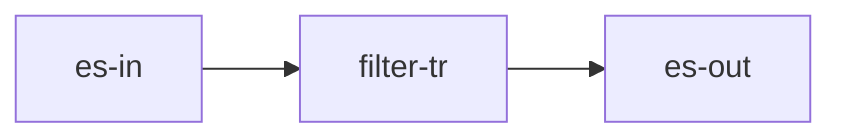

## 简介

- **节点标识**：Spark3.dataframe.general.transformer.Filter
- **节点类型**：转换节点
- **节点功能**：接收一个dataframe，以条件过滤后得到一个dataframe，并流转到多个下游节点
- **流批类型**：流批

## 输入输出数据结构

| 输入数据结构      | 输出数据结构      |
|-------------|-------------|
| 一个DataFrame | 一个DataFrame |

## 配置项

| 配置名称       | 配置类型             | 是否必填项 | 默认值 | 描述                                                                                             |
|------------|------------------|-------|-----|------------------------------------------------------------------------------------------------|
| conditions | Array[Condition] | 是     | -   | Condition(expression: String, isNot: Boolean = false)。会将多个expression以与的关系拼接到DataFrame的filter方法 |

## 使用案例

### DAG图



### job.json

```json
{
  "nodes": [
    {
      "flag": "Spark3.dataframe.batch.connector.CommonInput",
      "config": {
        "format": "es",
        "cfg": {
          "es.nodes": "127.0.0.1:9200,127.0.0.2:9200"
        }
      },
      "outLines": [
        "in-line"
      ]
    },
    {
      "flag": "Spark3.dataframe.general.transformer.Filter",
      "config": {
        "conditions": [
          {
            "expression": "f1=1"
          }
        ]
      },
      "inLines": [
        "in-line"
      ],
      "outLines": [
        "tr-line"
      ]
    },
    {
      "flag": "Spark3.dataframe.batch.connector.ESOutput",
      "config": {
        "resource": "index/docs",
        "cfg": {
          "es.nodes": "127.0.0.1:9200,127.0.0.2:9200",
          "es.mapping.id": "id",
          "es.nodes.wan.only": "true",
          "es.index.auto.create": "true"
        }
      },
      "inLines": [
        "tr-line"
      ]
    }
  ]
}
```
