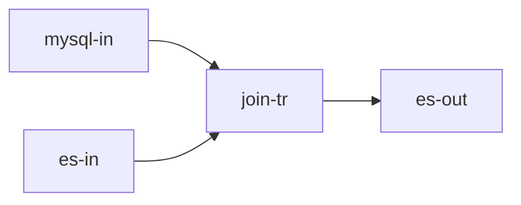

## 简介

- **节点标识**：Spark3.dataframe.general.transformer.Join
- **节点类型**：转换节点
- **节点功能**：接收两个dataframe，join后得到一个dataframe，并流转到多个下游节点
- **流批类型**：流批

## 输入输出数据结构

| 输入数据结构      | 输出数据结构      |
|-------------|-------------|
| 两个DataFrame | 一个DataFrame |

## 配置项

| 配置名称          | 配置类型                | 是否必填项 | 默认值  | 描述                                    |
|---------------|---------------------|-------|------|---------------------------------------|
| joinType      | String              | 否     | left | left, right                           |
| leftLine      | String              | 是     | -    | 取自inLines                             |
| rightLine     | String              | 是     | -    | 取自inLines                             |
| joinColumns   | Array[JoinColumn]   | 是     | -    | JoinColumn(leftColName, rightColName) |
| outputColumns | Array[OutputColumn] | 是     | -    | OutputColumn(line, inName, outName)   |

## 使用案例

### DAG图



### job.json

```json
{
  "nodes": [
    {
      "flag": "Spark3.dataframe.batch.connector.CommonInput",
      "config": {
        "format": "jdbc",
        "cfg": {
          "url": "jdbc:mysql://127.0.0.1:3306/daph",
          "dbtable": "t",
          "user": "root",
          "password": "root",
          "driver": "com.mysql.cj.jdbc.Driver"
        }
      },
      "outLines": [
        "in-line1"
      ]
    },
    {
      "flag": "Spark3.dataframe.batch.connector.CommonInput",
      "config": {
        "format": "es",
        "cfg": {
          "es.nodes": "127.0.0.1:9200,127.0.0.2:9200"
        }
      },
      "outLines": [
        "in-line2"
      ]
    },
    {
      "flag": "Spark3.dataframe.general.transformer.Join",
      "config": {
        "leftLine": "in-line1",
        "rightLine": "in-line2",
        "joinColumns": [
          {
            "leftColName": "f1",
            "rightColName": "f1"
          }
        ],
        "outputColumns": [
          {
            "line": "in-line1",
            "inName": "f1",
            "outName": "f1"
          },
          {
            "line": "in-line2",
            "inName": "f2",
            "outName": "f2"
          }
        ]
      },
      "inLines": [
        "in-line1",
        "in-line2"
      ],
      "outLines": [
        "tr-line"
      ]
    },
    {
      "flag": "Spark3.dataframe.batch.connector.ESOutput",
      "config": {
        "resource": "index/docs",
        "cfg": {
          "es.nodes": "127.0.0.1:9200,127.0.0.2:9200",
          "es.mapping.id": "id",
          "es.nodes.wan.only": "true",
          "es.index.auto.create": "true"
        }
      },
      "inLines": [
        "tr-line"
      ]
    }
  ]
}
```
